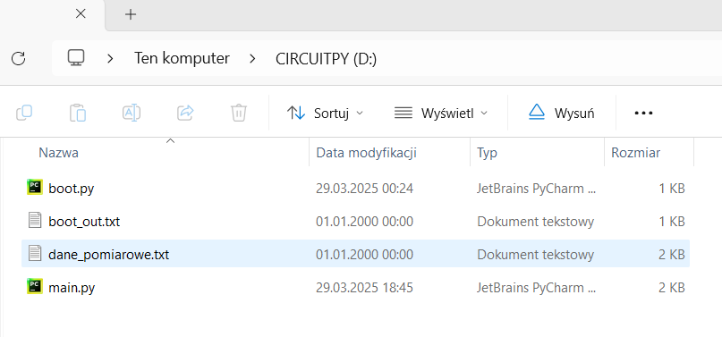
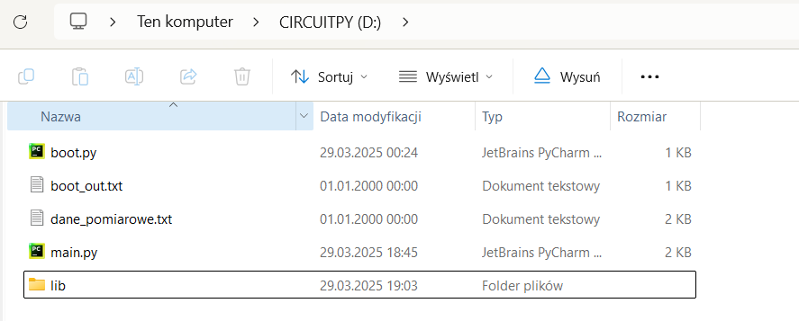
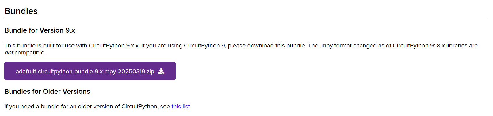
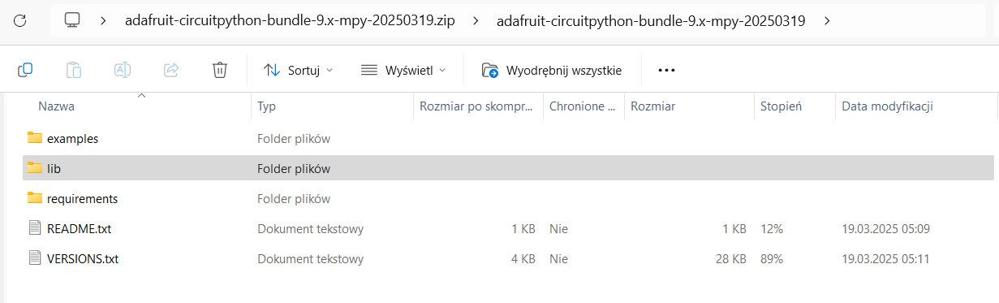
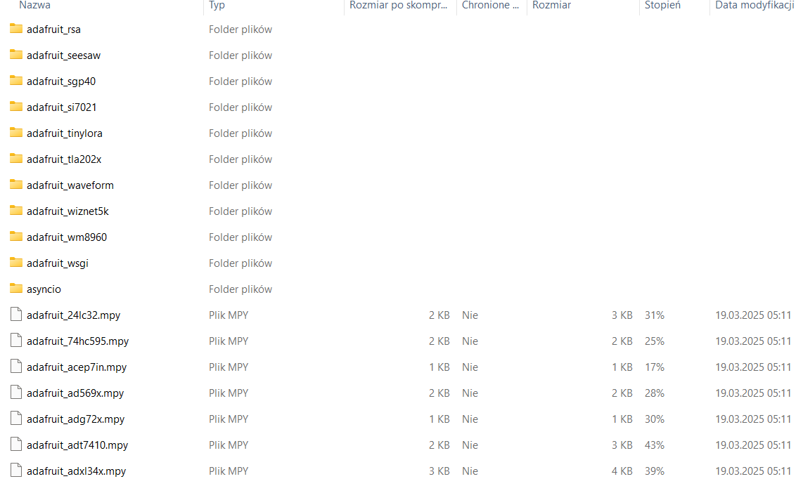
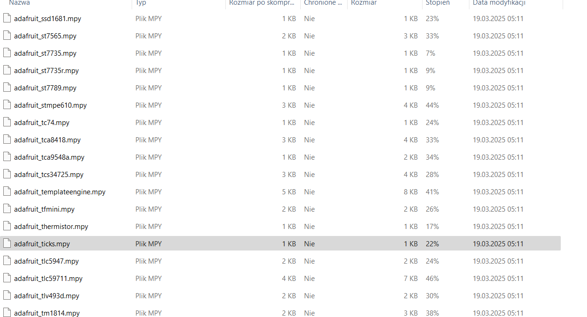

# Guide-How-to-install-asyncio-on-Raspberry-Pi-Pico-Raspberry-Pi-Pico-WH

First, create a `lib` folder in your **CIRCUITPY** drive (D:). 






Go to the official CircuitPython library page and download the latest bundle or bundle for your Circuitpython version:  

[(https://circuitpython.org/libraries)](https://circuitpython.org/libraries)





After downloading the ZIP file, open it and navigate to the `lib` folder inside the ZIP file.

Locate the following two files:  
- `asyncio` (folder)  
- `adafruit_ticks.mpy` (file) 









To check if asyncio is installed correctly, you can create a simple test script: 

```
import asyncio

async def test():
    print("Asyncio is working!")
    await asyncio.sleep(1)
    print("Done!")
asyncio.run(test())
