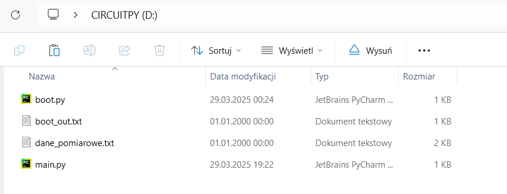
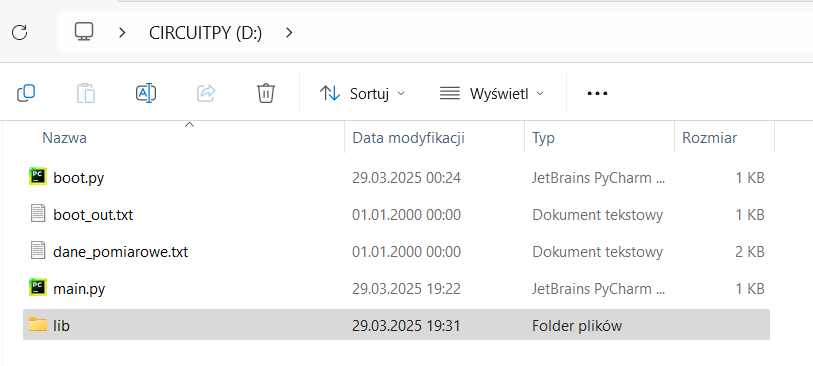
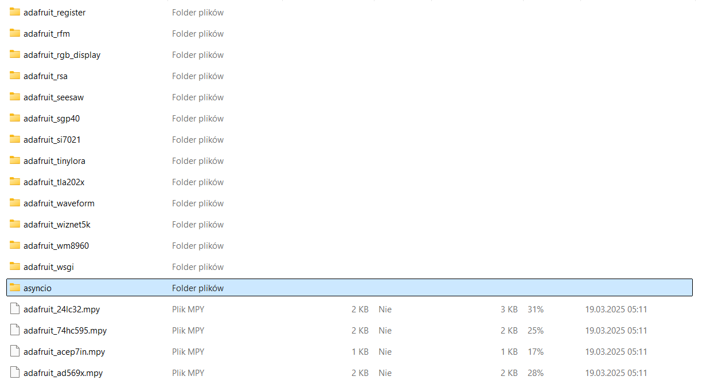

# Guide-How-to-install-asyncio-on-Raspberry-Pi-Pico-Raspberry-Pi-Pico-WH

First, create lib folder in you CIRCUITPY(D:)

Then download adafruit bundle with libraries for Circuitpython:

[(https://circuitpython.org/libraries)](https://circuitpython.org/libraries)

After downloading it, open the zip folder then open libaries and locate asyncio and adafruit_ticks.mpy: 

